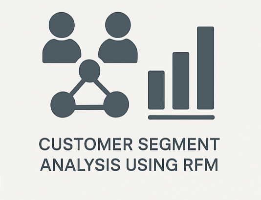

# Científico de Datos Jr.

#### Python | SQL | Pandas | NumPy | Scikit-Learn | Matplotlib |Regresión | Clasificación | Árboles de decisión | Métricas de evaluación | Power BI | Streamlit | FastAPI | Postman | Render | Jupyter Notebook | Visual Studio Code | GitHub | Entornos virtuales

## Educación
- 
  Ingeniería en Sistemas Computacionales | Universidad Kuepa (_Finaliza en 2026_)
  
## Experiencia Laboral
**Encargado General | Hotel Periférico, Oaxaca de Juárez (_Mayo 2020 - Marzo 2025_)**
- Diseñé y gestioné un sistema de registro de ocupación para analizar tendencias, identificar temporadas altas y ajustar estrategias operativas.
- Incrementé ingresos mediante una estrategia de promoción basada en análisis del comportamiento del cliente.
- Controlé el flujo de efectivo a través de conciliaciones diarias de ingresos y gastos.
- Coordiné mantenimientos correctivos y preventivos, documentando incidencias para mejorar la eficiencia.
- Lideré al equipo operativo, asignando tareas y administrando presupuesto e insumos.

## Experiencia Técnica
**Científico de Datos Jr. | Practicum - TripleTen (_Septiembre 2024 - Abril 2025_)**
- Desarrollé modelos de clasificación y regresión aplicados a problemas de negocio reales en distintos sectores.
- Analicé patrones de consumo y segmentación en la industria de videojuegos para optimizar decisiones de marketing.
- Construí un modelo de predicción de churn con AUC de 0.93, desplegado en una API con FastAPI y una app interactiva en Streamlit.
- Apliqué validación cruzada, regularización y análisis de importancia de variables para asegurar robustez del modelo.
- Elaboré un sistema de scoring crediticio utilizando modelos clásicos y complejos con explicabilidad incorporada.
- Presenté resultados con visualizaciones interactivas y comunicación clara para públicos técnicos y no técnicos.

## Proyectos Destacados

### API de para modelo de predicción churn
[Repositorio de Github](https://github.com/Lacruz0599/churn-prediction-api)

Esta API, desarrollada con FastAPI, forma parte de un proyecto de ciencia de datos orientado a predecir la pérdida de clientes (churn) en una empresa de telecomunicaciones. Su propósito es ofrecer una solución rápida y eficiente para integrar un modelo de machine learning en entornos productivos.
La API expone un punto de acceso donde se pueden enviar los datos de un cliente (como su antigüedad, consumo mensual, tipo de plan, entre otros), y devuelve una predicción de la probabilidad de que dicho cliente abandone el servicio. Esto permite automatizar procesos de retención y fortalecer la toma de decisiones estratégicas por parte del negocio.
El modelo subyacente fue entrenado con datos históricos y alcanza una AUC-ROC de 0.934, lo que garantiza un alto nivel de confiabilidad en sus predicciones. Gracias a la eficiencia de FastAPI, esta solución puede ser fácilmente desplegada en la nube y escalada según las necesidades del sistema.
Este proyecto demuestra la capacidad de llevar un modelo de machine learning desde su entrenamiento hasta su integración en una API funcional y lista para usarse en entornos reales, resaltando habilidades en MLOps y despliegue de soluciones basadas en datos.

### App Web para predicción de churn
[Repositorio de Github](https://github.com/Lacruz0599/Churn-Predictor-Web-App)

Esta aplicación web fue desarrollada con Streamlit como una herramienta interactiva para predecir la cancelación de clientes (churn) en una empresa de telecomunicaciones. Su propósito es brindar a los equipos de negocio una forma sencilla y visual de acceder al poder del machine learning sin necesidad de conocimientos técnicos.
A través de una interfaz amigable, los usuarios pueden ingresar datos relacionados con el comportamiento y características de un cliente (como el tipo de plan, uso mensual, número de llamadas, etc.). La aplicación se conecta automáticamente a una API construida con FastAPI, que procesa la información y devuelve una predicción en tiempo real sobre la probabilidad de que ese cliente abandone el servicio próximamente.
Esta predicción se basa en un modelo de machine learning entrenado previamente con datos históricos, logrando un excelente desempeño con una AUC-ROC de 0.934. La interfaz también incluye mensajes explicativos y elementos visuales para facilitar la interpretación de los resultados.
Esta app demuestra cómo la ciencia de datos puede integrarse de forma efectiva en procesos de toma de decisiones empresariales, transformando modelos complejos en herramientas accesibles que permiten actuar rápidamente frente a posibles pérdidas de clientes.

### Predicción de abandono de clientes en telecomunicaciones
[Repositorio de Github](https://github.com/Lacruz0599/prediccion-de-abandono-de-clientes-Telecom)

Este proyecto de ciencia de datos se enfoca en predecir la pérdida de clientes (churn) mediante la implementación de un modelo de machine learning entrenado con datos históricos de comportamiento de usuario. El modelo alcanzó un AUC-ROC de 0.934, lo que indica una alta capacidad para distinguir entre clientes que abandonan el servicio y los que permanecen. Además del análisis y entrenamiento del modelo, el proyecto incluye el desarrollo de una API REST con FastAPI, que permite realizar predicciones en tiempo real, y una interfaz web interactiva construida con Streamlit, diseñada para facilitar la interacción con el modelo por parte de usuarios no técnicos. Este enfoque integral permite integrar el modelo predictivo en entornos productivos, habilitando acciones preventivas y decisiones basadas en datos para reducir la tasa de abandono de clientes.

### Segmentación de Clientes con Clustering RFM
[Repositorio de Github](https://github.com/Lacruz0599/Segmentaci-n-de-clientes-con-RFM)

Este proyecto tiene como objetivo aplicar técnicas de aprendizaje no supervisado para segmentar clientes de un negocio de retail en línea, utilizando datos históricos de transacciones. A través del enfoque RFM (Recency, Frequency, Monetary), se analizó el comportamiento de compra de cada cliente en función de la fecha de su última compra, la frecuencia con la que realiza pedidos y el monto total que ha gastado. Esta segmentación permitió identificar patrones de comportamiento diferenciados entre grupos de clientes, lo que a su vez facilita la toma de decisiones estratégicas en áreas como marketing personalizado, fidelización y reactivación de usuarios. Al entender mejor las características y necesidades de cada segmento, la empresa puede diseñar campañas más efectivas y enfocadas, optimizando así los recursos y maximizando el valor de cada cliente.

### Análisis exploratorio de ventas en videojuegos
[Repositorio de Github](https://github.com/Lacruz0599/creando-perfiles-de-ventas-para-regiones-mundiales)

Este proyecto consistió en un análisis exploratorio de datos de ventas de videojuegos con el objetivo de identificar las plataformas, géneros y clasificaciones (ratings) más rentables en distintas regiones del mundo. A partir del procesamiento y visualización de los datos, se analizaron patrones de consumo diferenciados en Norteamérica, Europa y Japón, lo que permitió construir perfiles de comportamiento según las preferencias regionales. Este enfoque no solo facilitó la detección de tendencias globales en la industria del videojuego, sino que también proporcionó información valiosa para la toma de decisiones estratégicas en áreas como marketing, desarrollo de productos y distribución internacional.

---

## Contacto
- Email: cesareduardocruzcabrera@gmail.com  
- LinkedIn: [linkedin.com/in/cesar-eduardo-cruz-cabrera](https://www.linkedin.com/in/cesar-eduardo-cruz-cabrera)  
- GitHub: [github.com/Lacruz0599](https://github.com/Lacruz0599)  
- Teléfono: +52 9516128065
